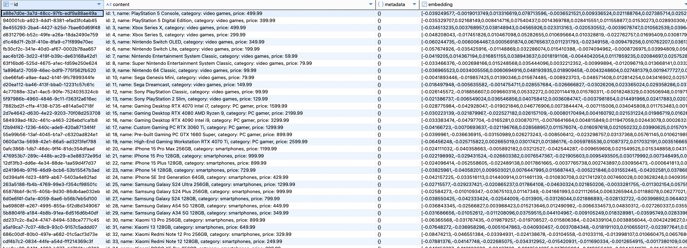
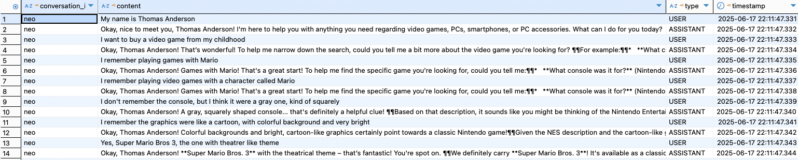

# Spring AI

This project shows how to use Spring AI to build a assintant buyer for a customer.

This assistant is built using LLM (Ollama, Claude or OpenAI) to assist a customer to buy a product.
The products is stored in data base for management, stored in vector store to be used in RAG with LLM.

## Introduction

> A big part of building a Spring AI application is deciding upon which vector store, embedding model, and chat model you will use.

Spring AI is a collection of Spring Boot libs to allow a application to connect to AI models easily and production-ready workflows.

> Spring AI addresses the fundamental challenge of AI integration: Connecting your enterprise Data and APIs with AI Models.

Spring AI currently supports models that process input and output as language, image, and audio.

## Glossary

- embeddings: numeric representation of text stored in vectors.
- vectore store: data base os embeddings stored in semantic dimensional space of vectors that captures the relationship between differents embeddings.
- chat memory: transcript of LLM interation that is attached to each prompt to provide historic memory to the model (as they are stateless).

## Tools

### Models

Spring AI provides integration libs to many models.
The configuration for the models is pretty much standard through properties.
Ollama has more customizable configuration properties given its flexibility.

Models:

- `spring-ai-starter-model-anthropic`:
  - starter to use Claude model
  - needs to set property `spring.ai.anthropic.api-key`.
- `spring-ai-starter-model-openai`:
  - starter to use OpenAI model
  - needs to set property `spring.ai.openai.api-key`.
- `spring-ai-starter-model-ollama`:
  - starter to use local Ollama model
  - needs to set property `spring.ai.ollama-base-url` (default is `http://localhost:11434`)
  - needs to set property `spring.ai.ollama.chat.options.model` with the local model (must be installed with `ollama pull`)

The property `spring.ai.model.chat` define which models we are using when there is more than one available.
Also, we should set `spring.ai.model.embedding` to the model we are using when there is more than one embedding advice available.

### Actuator

Spring AI integrates with Actuator to expose metrics about the operation and tokens usage.

Available metrics:

- `gen_ai.client.operation`
- `gen_ai.client.operation.active`
- `gen_ai.client.token.usage`.

Example: `http://localhost:8080/actuator/metrics/gen_ai.client.token.usage`

### Chat Memory

The model doesn't keep track of chat history, it is stateless, each prompt is done in blank canvas.
Spring AI provides a way to store the chat memory and use it as part of the prompt to chat with the model.

Before choosing a memory type, it’s essential to understand the difference between chat memory and chat history.

- **Chat Memory**: the information that a LLM retains and uses to maintain contextual awareness throughout a conversation.
- **Chat History**: the entire conversation history, including all messages exchanged between the user and the model.

The chat memory is implement with the abstraction `ChatMemory` and it uses a `ChatMemoryRepository` to store the interations.
`ChatMemory` decides which messages it should keep or discard, there are some strategies that we can choose.

By default, an in-memory chat memory (`InMemoryChatMemoryRepository`) is provided by the Spring but we also can use different kinds of stores (like JDBC, Redis, Elasticsearch).
We must configure a bean `PromptChatMemoryAdvisor` to setup the chat memory to be used.
We also must provide the advisor to `ChatClient.Builder` to allow the model to use the chat memory.

In the prompt, we can set the advisor parameter to define which conversation it should use, otherwise it will be shared across all prompts.
`.advisors(advisorSpec -> advisorSpec.param(ChatMemory.CONVERSATION_ID, username)`

#### JDBC Chat Memory

To store chat memory using JDBC we must add the `spring-ai-starter-model-chat-memory-repository-jdbc` dependency.

We can select the table with the chat memory registers:

```sql
SELECT conversation_id, content, type, timestamp FROM public.spring_ai_chat_memory;
```

### RAG

Retrieval Augmented Generation (RAG) is a technique useful to overcome the limitations of LLM that struggle with long-form content, factual accuracy, and context-awareness.

Spring AI supports RAG by providing a modular architecture that allows to build custom RAG flows yourself or use out-of-the-box RAG flows using the Advisor API.

Spring AI provides out-of-the-box support for common RAG flows using the Advisor API.
To use the `QuestionAnswerAdvisor` or `RetrievalAugmentationAdvisor`, we need the `spring-ai-advisors-vector-store` dependency.

A vector database stores data that the AI model is unaware of.
When a user question is sent to the AI model, a `QuestionAnswerAdvisor` queries the vector database for documents related to the user question`
The response from the vector database is appended to the user text to provide context for the AI model to generate a response.

Is useful to setup a `PromptTemplate` with the content to instruct the LLM how to handle the context information provided with RAG and how to answer the query.
This prompt template can be passed to `QuestionAnswerAdvisor` builder.

```markdown
<query>

Context information is below.

---------------------
<question_answer_context>
---------------------

Given the context information and no prior knowledge, answer the query.

Follow these rules:

1. The store sells the following categories of products:
- video games: Playstation 5, X-box One, Nintendo Switch
- PC gamer
- smartphones: iPhone, Samsung, Xiaomi
- PC accessories: keyboard, mechanical keyboard, mouse, mousepad, headset, webcam
2. You should ask for the customer name and what are the kind of platforms, videos games and type of games that he or she likes.
3. If the customer is looking for a product outside of the categories of products selled by the store, you should say that the store do not sell that kind of product.
4. You should ask about the customer relationship or expectation about the product, try to understand what are the intentions with the product and how important it is for the customer, try to be succinct when asking to not wast much time.
5. You should try to engage the customer with information and felling about the product before trying to selling it.
6. You should try to engage the customer relationship and expectation only once, if there is no related response then just try to offer the products that the customer is interested.
7. Once the customer decided which product wants to buy, you should just redirect the customer to the product page to start the purchase, the link has the following format: http://springai-tech-store.com.br/products/PRODUCT_ID/details, you should replace the PRODUCT_ID part with the ID of the selected product.
```

#### Vector Store

Spring AI tools for Vector Store:

- `spring-ai-advisors-vector-store`: Advisor API to integrate vector store to chat client.
- `spring-ai-starter-vector-store-pgvector`: enable PostgreSQL to act as vector store.
- `spring-ai-starter-model-postgresml-embedding`: embedding model to enable PostgreSQL to turn any data (text, image, audio) into embeddings to be stored in vector store.

Exemple of vector store registers after it was loaded:



## PostgreML

Vector stored used here is [PostgresML](ghcr.io/postgresml/postgresml).

Links

- Notebook: `http://localhost:8000/engine/notebooks`

## Prompting

In this example, the prompting is done using body parameter `question`.

Introduce yourself to the assistant to test the chat memory:

```sh
http POST http://localhost:8080/store/users/neo/assistant-buyer question="My name is Thomas Anderson"
http POST http://localhost:8080/store/users/neo/assistant-buyer question="What is my name?"
```

Start the buying interation:

```sh
http POST http://localhost:8080/store/users/neo/assistant-buyer question="My name is Thomas Anderson"
http POST http://localhost:8080/store/users/neo/assistant-buyer question="I like Playstation and Nintendo, usually I play games of type action, adventure, sports, puzzle and horror"
http POST http://localhost:8080/store/users/neo/assistant-buyer question="I want to buy a video game from my childhood"
http POST http://localhost:8080/store/users/neo/assistant-buyer question="I remember playing video games with a character called Mario"
http POST http://localhost:8080/store/users/neo/assistant-buyer question="I remember the graphics were like a cartoon, with colorful background and very bright"
http POST http://localhost:8080/store/users/neo/assistant-buyer question="Yes, Super Mario Bros 3, the one with theatre like theme"
```

**Example**

[Example of interation](transcript.md).

**Chat Memory**



## Running

Start the container with PostgresML.

Connect to it and run the following script:

```sql
CREATE ROLE springai WITH LOGIN PASSWORD 'unhackable';
CREATE DATABASE springaidb OWNER springai;
GRANT ALL PRIVILEGES ON DATABASE springaidb TO springai;
GRANT ALL PRIVILEGES ON DATABASE postgresml TO springai;
GRANT USAGE ON SCHEMA public TO springai;
GRANT CREATE ON SCHEMA public TO springai;
GRANT USAGE ON SCHEMA public TO springai;
GRANT CREATE ON SCHEMA pgml TO springai;
GRANT USAGE ON SCHEMA pgml TO springai;
```

## Links

- [Spring AI Docs](https://docs.spring.io/spring-ai/reference/index.html)
- [AI Concepts](https://docs.spring.io/spring-ai/reference/concepts.html)
- [Zero-shot Chain of Thought](https://arxiv.org/pdf/2205.11916)
- Models configurations for Spring AI:
  - [Ollama](https://docs.spring.io/spring-ai/reference/api/chat/ollama-chat.html)
  - [OpenAI](https://docs.spring.io/spring-ai/reference/api/chat/openai-chat.html)
  - [Claude](https://docs.spring.io/spring-ai/reference/api/chat/anthropic-chat.html)
- [Chat Memory](https://docs.spring.io/spring-ai/reference/api/chat-memory.html)
- [PGVector](https://docs.spring.io/spring-ai/reference/api/vectordbs/pgvector.html)
