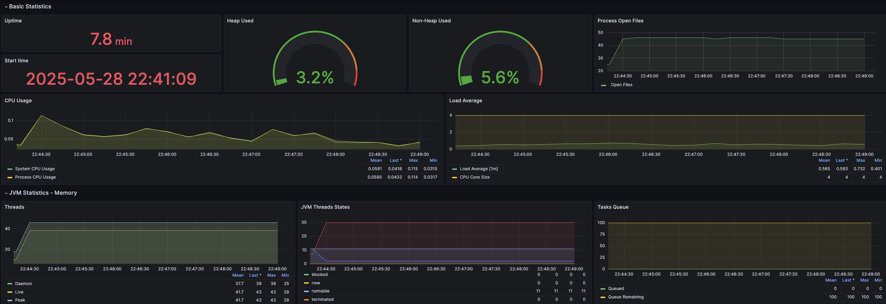

# Thread Pool Starvation

URLs:

- Prometheus metrics: `http://localhost:8080/actuator/prometheus`
- Prometheus panel: `http://localhost:9090/`
- Grafana panel: `http://localhost:3000`

Prometheus metrics that we wanna to tweak:

```sh
# HELP executor_active_threads The approximate number of threads that are actively executing tasks
executor_active_threads{name="applicationTaskExecutor"} 0.0

# HELP executor_pool_core_threads The core number of threads for the pool
executor_pool_core_threads{name="applicationTaskExecutor"} 8.0
# HELP executor_pool_max_threads The maximum allowed number of threads in the pool
executor_pool_max_threads{name="applicationTaskExecutor"} 20.0
# HELP executor_pool_size_threads The current number of threads in the pool
executor_pool_size_threads{name="applicationTaskExecutor"} 0.0

# HELP executor_queue_remaining_tasks The number of additional elements that this queue can ideally accept without blocking
executor_queue_remaining_tasks{name="applicationTaskExecutor"} 100.0
# HELP executor_queued_tasks The approximate number of tasks that are queued for execution
executor_queued_tasks{name="applicationTaskExecutor"} 0.0
```

## JConsole

Open `jconsole` and connect to `localhost:9010`.

## Prometheus

Check scrapper health check: `http://localhost:9090/targets`

## Grafana

Default user and password is `admin`.

Setup:

- Configure the Datasource
  - Prometheus URL: `http://prometheus:9090`
  - Import dashboard:
    - URL: `http://localhost:3000/dashboard/import`
    - file `dashboards/spring boot 3.x grafana dash.json`


