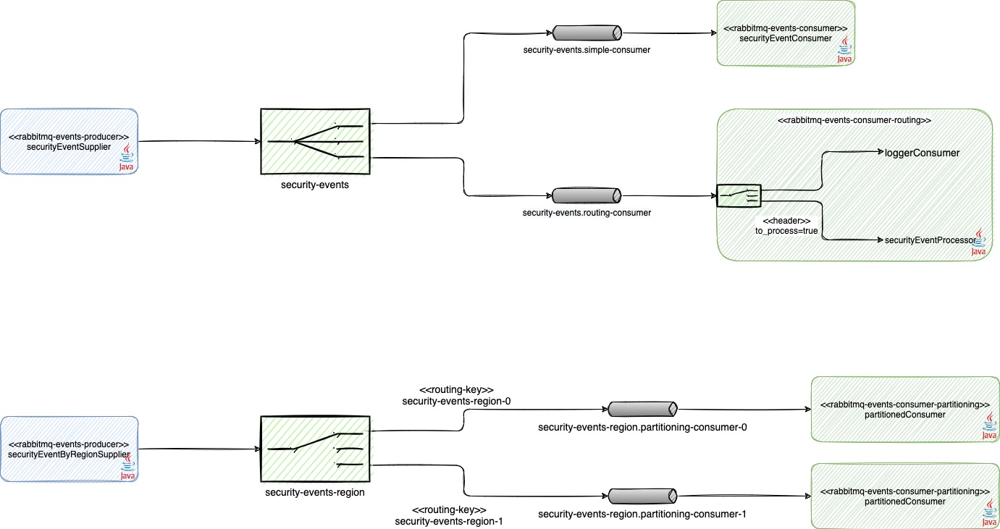
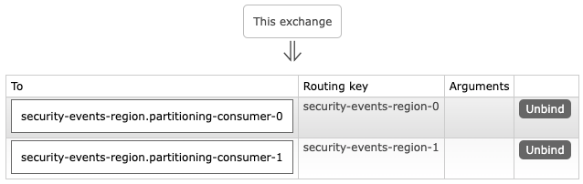

# Spring Cloud Stream

## RabbitMQ

Run broker:

```sh
docker run --rm -it --name rabbitmq -p 5672:5672 -p 15672:15672 rabbitmq:management
```

## Projects

- rabbitmq-events-producer:
  - produces the messages and expose a REST API to publish a message
  - has two suppliers: one to simple message and another with routing key
- rabbitmq-events-consumer: show how to build a simple consumer
- rabbitmq-events-consumer-routing: show how to use routing expression with differents consumers
- rabbitmq-events-partitioning: show how to use partitioned consumers
- rabbitmq-events-consumer-testing: show how to test a consumer

Bellow is the complete diagram:



### Producer

The producer has two supplier that can be defined using the property `spring.cloud.function.name`.

The producer sends a message each second with a header `to_process=true`.

The posting a message using REST API, it will be sent without any header so the routing consumer can only log it.

```
POST localhost:8080/security/events

{
	"message": "Message to be logged"
}
```

### Consumers

There are 3 consumers:

- simple consumer: only logs the message (pritns `Security event consumed`);
- routing: defines two functions that is routed depending on header `to_process=true`
  - no header: logs the message (prints `Security event logged`);
  - header: logs the message (prints `Security event processed`) and return a value to another Exchange.
- partitioning: logs the message (prints `Security event processed from consumer index #`) from its specified consumer index (env `spring.cloud.stream.instanceIndex`).

To run the partitioned consumer we can set the `INSTANCE_INDEX` with the consumer index:

```sh
export INSTANCE_INDEX=0
mvn spring-boot:run
```

Bellow is the bindings running two instances:



## References

- [Spring Cloud Stream - RabbitMQ](https://github.com/spring-cloud/spring-cloud-stream-binder-rabbit)

